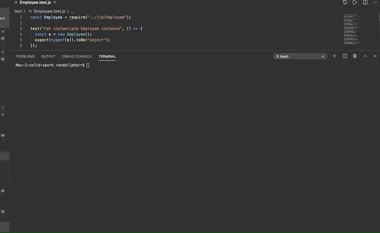

# solid-spork

Quickly build a webpage displaying a project's team members.  From the command line enter information for team manager, engineers and interns to have access to thier employee data such as ID, email, github profiles, school, and office number.

## installation

    git clone https://github.com/krpharr/solid-spork.git
    cd solid-spork
    npm install
    node app.js

## dependencies

NPM
<ul>
    <li>chalk-pipe</li>
    <li>fs</li>
    <li>html-format</li>
    <li>inquirer</li>
    <li>materialize-css</li>
    <li>util</li>
</ul>

    JavaScript
    HTML
    CSS

